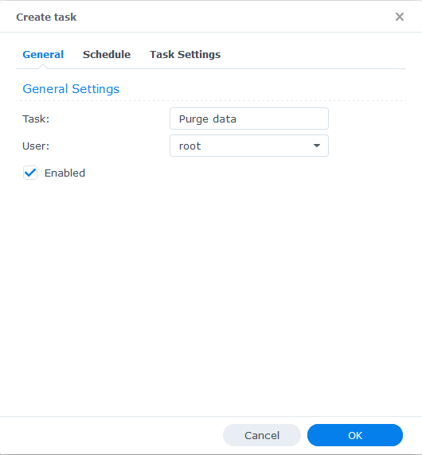

# synology-purge

## How to use

usage: syno_purge_older.py -d DIRECTORY -l LIMIT [-s SIZE] [-i IGNORE]
```
optional arguments:
  -h, --help            show this help message and exit
  -d DIRECTORY, --directory DIRECTORY
                        Define which directory to purge
  -l LIMIT, --limit LIMIT
                        Size limit before cleaning
  -s SIZE, --size SIZE  Size to clean - DEFAULT 1GB
  -i IGNORE, --ignore IGNORE
                        Files to ignore
```
Exemmple
* Purge 5GB in /var/log if size superior than 50GB
  * purge_older.py -d /var/log -l 50 -s 5
* As previous with ignoring .git and store
  * purge_older.py -d /var/log -l 50 -s 5 -i '.git;store'

## How to set on Synology


  
  
  
  
